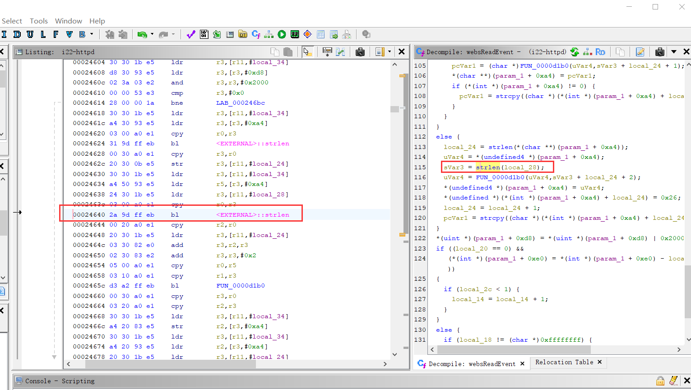

# Overview
Details of the vulnerability found in the tenda router i22 V1.0.0.3 (4687).

| Firmware Name  | Firmware Version  | Download Link  |
| -------------- | ----------------- | -------------- |
| i22    | V1.0.0.3(4687)    | https://static.tenda.com.cn/tdcweb/download/uploadfile/i22/US_i22V1.0BR_V1.0.0.3(4687)_CN_TDC01.zip    |

# Vulnerability details
## Vulnerability trigger Location
The following vulnerability analysis and explanation are based on the i22 router with  firmware version `V1.0.0.3(4687)`.

For easier analysis, I referred to the GoAhead 2.5 source code on https://github.com/ehlalwayoUk/goahead/tree/master and modified the variable names accordingly in Ghidra. The vulnerability trigger location is at the `strlen` function call within the `websReadEvent` function, at address 0x24640.
